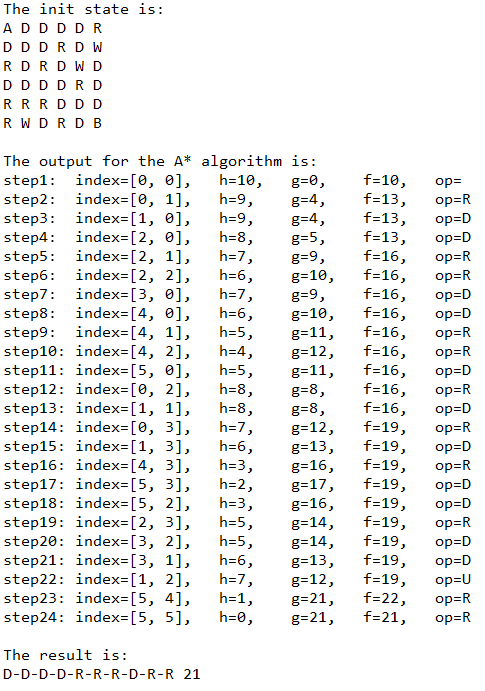
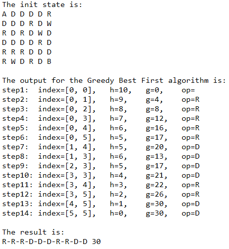

# Astar & Greedy Best First

The program implements a route search in a board of NxN size, in order to get from the start \
point A to endpoint B using the algorithms: Greedy Best First and A*. Each cell on the board  \
depicts an area cell. The area cell can be through paved R, through unpaved D, or water W.

You can move on the board from the current cell to the adjacent cell using the following actions: \
up U, down D, right R, left L. Note: the movement to the water or out of the board is prohibited.

The cost of the passage (function g) is calculated according to the type of area cell: \
use of through paved = 1, use of through unpaved = 4.

The program reads from the 'input.txt' input file containing:
1. The type of algorithm to be run (line number 1 in the file).
2. Board size (row number 2 in the file).
3. Initial board mode (line number 3 to the end of the file).

At the end of the program the search results, the route from A to B, \
and its cost are written to the output file 'output.txt'.

## Greedy Best First algorithm
1. Build a search graph G, with an init state, state, and put state in the OPEN list.
2. Create an empty CLOSE list.
3. Loop: As long as OPEN is not empty:
4. Sort the OPEN according to h (distance manhattan).
5. Select the first state (next_state) in OPEN, remove next_state from OPEN and insert it into CLOSE.
6. If next_state is a target state, return the cost and route.
7. Expand next_state and create its sons M in G.
8. For states from M not in OPEN or CLOSE - calculate h, enter OPEN, \
   and create a pointer from them to next_state (the parent).
          
## A* algorithm
1. Build a search graph G, with an init state, state, and put state in the OPEN list.
2. Create an empty CLOSE list.
3. Loop: As long as OPEN is not empty:
4. Sort the OPEN according to f.
5. Select the first state (next_state) in OPEN, remove next_state from OPEN and insert it into CLOSE.
6. If next_state is a target state, return the cost and route.
7. Expand next_state and create its sons M in G.
8. For states from M not in OPEN or CLOSE - calculate f, enter OPEN, \
   and create a pointer from them to next_state (the parent).
9. For the rest of the M states that are in OPEN or CLOSE, you need to decide if \
   update f and put a pointer to next_state (the new parent) or not.
          
### Requirements
~~~bash
pip install pycopy-copy
~~~

## Results
### A* algorithm:

  

### Greedy Best First algorithm:

  

